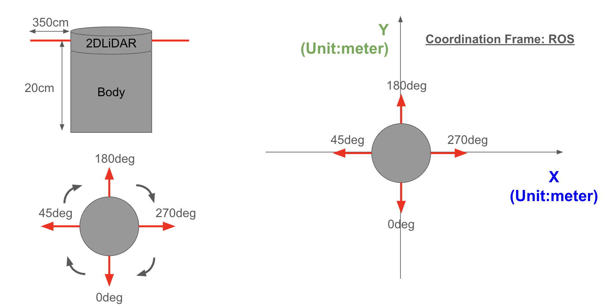
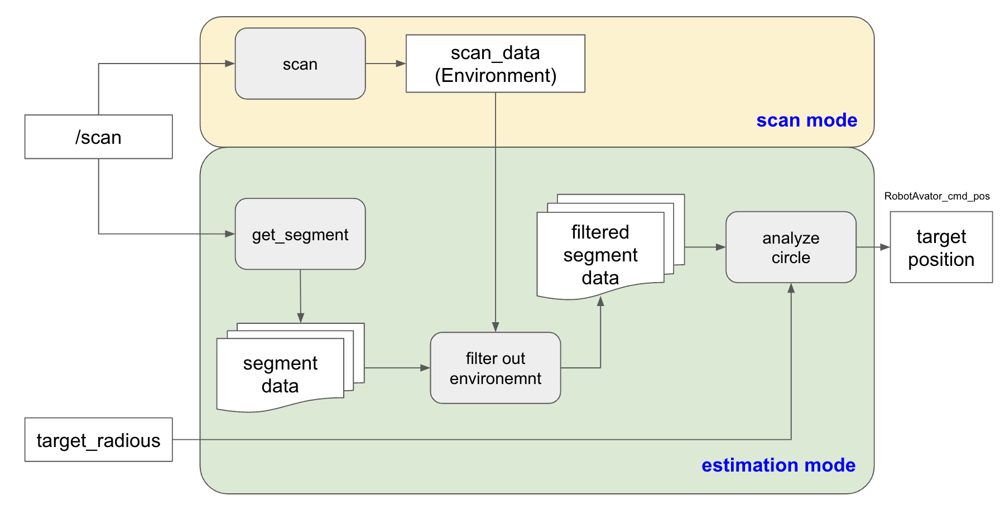

# hakoniwa-digital-twin

本リポジトリでは、バーチャル・ドローンとリアル・ロボット(TODO)が、箱庭を通して相互運用するデジタルツインのデモ環境を提供します。


## デモ

### 登場物

* バーチャル側
  * バーチャル・ドローン
    * バーチャルな世界にだけ存在するドローンです
    * 荷物を運搬し、バーチャルロボットに渡します
  * 荷物
    * バーチャル世界にだけ存在する荷物です
  * バーチャル・ロボット(Twin)
    * リアル世界のロボットのTwinです
    * バーチャル世界のイベントをセンサデータとしてリアル世界のロボットに通知します
* リアル側
  * インフラセンサ(LiDAR)
    * リアルロボットの位置推定を行います
  * リアル・ロボット(TODO)
    * インフラセンサの情報とバーチャル側のセンサ情報を入力として荷物運搬の制御を行います
* [箱庭ブリッジ](https://github.com/toppers/hakoniwa-bridge/tree/main)
  * ShmProxy
    * 箱庭PDUデータをリアルとバーチャルとで共有します
  * RosProxy
    * ROSメッセージをリアルとバーチャルとで共有します

### デモ内容

* バーチャル・ドローンのシナリオ
  * バーチャル・ドローンは、バーチャル世界の荷物集積場に移動します
  * バーチャル・ドローンは、荷物集積場で荷物を受け取ります
  * バーチャル・ドローンは、リアルロボットの位置を受信し、目標移動ポイントを設定します
  * バーチャル・ドローンは、リアルロボットの位置まで移動します
  * バーチャル・ドローンは、目標位置に到着したら高度をリアルロボット上の50cmあたりで泊まり、荷物を下ろします
  * 荷物を下ろした後、バーチャル・ドローンは、荷物集積場に戻ります
* バーチャル・ロボットのシナリオ
  * バーチャル・ロボットは、リアル・ロボットの位置を受信し、バーチャル空間上の同じ位置に移動します
  * バーチャル・ロボットは、荷物が置かれたことを検出するためのタッチセンサを装備しており、荷物の配置有無の情報を箱庭PDUデータで共有します
* リアル・ロボットのシナリオ
  * リアル・ロボットは、荷物を受け取る場所で待機状態として、停止しています
  * リアル・ロボットは、荷物が置かれたことを検出した場合、前進します
  * リアル・ロボットは、前進中に超音波センサで所定の目標位置に到達したことを検出すると停止します
  * リアル・ロボットは、目標地点に到着したことをバーチャル側に通知します
  * バーチャル側でその通知を受け取ると、バーチャル側の操作で荷物を下ろします
  * リアル・ロボットは、荷物が下ろされたことを検出すると、元の位置に後進し、待機状態に戻ります


## アーキテクチャ


## 動作環境

* バーチャル側
  * MacOS
* リアル側
  * RosProxy: Ubuntu(ROS2)
  * Infra Sensor: TurtleBot3's LiDAR & Raspberry Pi3(ROS2)
  * Real Robot: TODO & Raspberry Pi4(ROS2)

## インストール手順

### コンフィグファイルの作成

箱庭のコンフィグファイルである custom.jsonは、リアルとバーチャルとで共有しますので、それぞれにコピー配置してください。
custom.jsonは、箱庭ドローンシミュレータのUnityエディタ上で、`Generate`を実行することで作成できます。

### リアル側

リアル側では、以下の対応が必要となります。

* [Ubuntu PC に RosProxyをインストール](#UbuntuPCにRosProxyをインストール)
* [TB3にインフラセンサモジュールをインストール](#TB3にインフラセンサモジュールをインストール)
* ロボット：TODO

#### UbuntuPCにRosProxyをインストール

リポジトリのクローン：
```
git clone --recursive https://github.com/toppers/hakoniwa-digital-twin.git
```

ディレクトリの移動：
```
cd hakoniwa-digital-twin/bridge/third-party/hakoniwa-ros2pdu
```

RosProxyのインストール：

https://github.com/toppers/hakoniwa-bridge?tab=readme-ov-file#installation-instructions

#### TB3にインフラセンサモジュールをインストール

リポジトリのクローン：
```
git clone --recursive https://github.com/toppers/hakoniwa-digital-twin.git
```

ディレクトリの移動：
```
cd hakoniwa-digital-twin/bridge/real/sensors
```

ビルド：
```
colcon build --packages-select infra_sensor_2dlidar
```

成功するとこうなります。
```
Starting >>> infra_sensor_2dlidar
Finished <<< infra_sensor_2dlidar [4.47s]   
```

### バーチャル側

バーチャル側では、以下の対応が必要となります。

* [箱庭ドローンシミュレータのインストール](https://github.com/toppers/hakoniwa-px4sim)
* [ShmProxyのインストール](#ShmProxyのインストール)


#### ShmProxyのインストール

リポジトリのクローン：
```
git clone --recursive https://github.com/toppers/hakoniwa-digital-twin.git
```

ディレクトリの移動：
```
cd hakoniwa-digital-twin/bridge/third-party/hakoniwa-ros2pdu
```

ShmProxyのインストール：

https://github.com/toppers/hakoniwa-bridge?tab=readme-ov-file#installation-instructions


## 実行手順

1. 箱庭ドローンシミュレータを起動する
2. [ShmProxyを起動する](https://github.com/toppers/hakoniwa-bridge?tab=readme-ov-file#shmproxy)
3. [RosProxyを起動する](https://github.com/toppers/hakoniwa-bridge?tab=readme-ov-file#rosproxy)
4. [TB3のROSノードを起動する](TB3のROSノードを起動する)
5. [Infra Sensorを起動する](#InfraSensorを起動する)
6. リアル・ロボットを起動する
7. バーチャル・ドローンのオペレーションを開始する

### TB3のROSノードを起動する

ディレクトリ移動：
```
cd turtlebot3_ws
```

ROSノード起動：
```
source install/setup.bash 
```

```
ros2 launch turtlebot3_bringup robot.launch.py
```

### InfraSensorを起動する

```
source install/setup.bash 
```

```
ros2 run infra_sensor_2dlidar lidar_subscriber
```

成功するとこうなります。
```
[INFO] [1715210973.115290281] [lidar_subscriber]: InfraSensor UP
```

ubuntu PC 側で、以下のコマンドを発行して、`RobotAvator_cmd_pos`が見えれば成功です。

```
ros2 topic list
```

事項結果：
```
/RobotAvator_cmd_pos
/parameter_events
/rosout
/scan
```

## プログラム構成

本リポジトリのプログラム構成は以下の通り。

* real
  * リアル側のソースコード一式を管理
* digital
  * バーチャル側のソースコード一式を管理
* bridge
  * 箱庭ブリッジ（サブモジュールとして管理）

## インフラセンサ

### 仕様



* 測定可能範囲：
  * 半径10cmの場合：
    * -0.4m <= X <= 0.4m
    * -0.4m <= Y <= 0.4m

### 位置推定方法

TurtleBot3 の 2DLiDARのデータから指定された半径の円柱の位置を推定します(下図)。



### パラメータ

インフラセンサモジュールのパラメータは、`InfraSensorPositionEstimater`のコンストラクタで与えます。

### パラメータ

1. **b_degree (基準角度)**
   - **説明**: センサーの基準となる角度を設定します。この角度を基点として、センサーが計測したデータの相対角度が計算されます。
   - **用途**: センサーの向きや配置に応じた基準角の設定に使います。

2. **mean_max (平均化最大数)**
   - **説明**: セグメントやスキャンデータを保持するためのキューの最大長を指定します。この値は、データの平均化や過去データの参照に影響します。
   - **用途**: データの平滑化やノイズ除去に影響し、平均化するデータポイントの数を制御します。

3. **th_variance (分散閾値)**
   - **説明**: 推定されたデータポイントはデータポイントは、mean_maxだけ記録します。最終的な推定結果は、これらの記録に対して、平均値を求め、th_varianceよりも大きな値は除外します。
   - **用途**: センサーデータから異常値やノイズを除去する際に使用され、データのクリーニング効率を向上させます。

4. **t_radius (ターゲット半径)**
   - **説明**: 検出対象となる円の半径の目標値です。この値に基づいて、計算された半径がこの目標値にどれだけ近いかを評価します。
   - **用途**: 特定の半径を持つ物体を検出する際に使用され、例えば特定のサイズの円形オブジェクトのみを識別するために利用します。

5. **t_cv (チェック閾値)**
   - **説明**: 解析された円の品質を評価するための閾値です。この値は、最小二乗法でのフィットの品質（MAEや分散）を判断する際に使用され、設定値以下であれば円としての検出が有効とみなされます。
   - **用途**: 円の検出精度を制御し、高品質なデータのみを有効な検出結果として扱います。

### インフラセンサのデバッグ環境
インフラセンサをデバッグするために、TB3 LiDARのビジュアライズすると直感的な理解が可能になります。

#### インストール方法

```
sudo apt install ros-foxy-turtlebot3
```

```
sudo apt install ros-foxy-turtlebot3-bringup ros-foxy-turtlebot3-cartographer ros-foxy-turtlebot3-navigation2

```

#### Rviz2 起動方法

```
ros2 launch turtlebot3_bringup rviz2.launch.py
```

成功すると下図のように表示されます。


