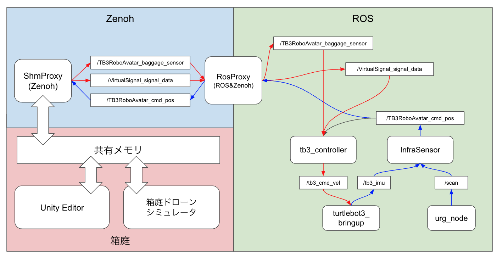

# hakoniwa-digital-twin

本リポジトリでは、バーチャル・ドローンとリアル・ロボット(TB3)が、箱庭を通して相互運用するデジタルツインのデモ環境を提供します。


## デモ

### 登場物

* バーチャル側
  * バーチャル・ドローン
    * バーチャルな世界にだけ存在するドローンです
    * 荷物を運搬し、バーチャルロボットに渡します
  * 荷物
    * バーチャル世界にだけ存在する荷物です
  * バーチャル・ロボット(Twin)
    * リアル世界のロボットのTwinです
    * バーチャル世界のイベントをセンサデータとしてリアル世界のロボットに通知します
  * バーチャル信号
    * バーチャル世界の信号です
    * 赤、黄、青の状態を持ちます
* リアル側
  * インフラセンサ(LiDAR)
    * リアルロボットの位置推定を行います
  * リアル・ロボット(TB3)
    * インフラセンサの情報とバーチャル側のセンサ情報を入力として荷物運搬の制御を行います
* [箱庭ブリッジ](https://github.com/toppers/hakoniwa-bridge/tree/main)
  * ShmProxy
    * 箱庭PDUデータをリアルとバーチャルとで共有します
  * RosProxy
    * ROSメッセージをリアルとバーチャルとで共有します

### デモ内容

* バーチャル・ドローンのシナリオ
  * バーチャル・ドローンは、バーチャル世界の荷物集積場に移動します
  * バーチャル・ドローンは、荷物集積場で荷物を受け取ります
  * バーチャル・ドローンは、リアルロボットの位置を受信し、目標移動ポイントを設定します
  * バーチャル・ドローンは、リアルロボットの位置まで移動します
  * バーチャル・ドローンは、目標位置に到着したら高度をリアルロボット上の50cmあたりで止まり、荷物を下ろします
  * 荷物を下ろした後、バーチャル・ドローンは、荷物集積場に戻ります
* バーチャル・ロボットのシナリオ
  * バーチャル・ロボットは、リアル・ロボットの位置を受信し、バーチャル空間上の同じ位置に移動します
  * バーチャル・ロボットは、荷物が置かれたことを検出するためのタッチセンサを装備しており、荷物の配置有無の情報を箱庭PDUデータで共有します
* バーチャル信号のシナリオ
  * バーチャル信号は、決められたルールに従って、信号の状態を変更します
    * ルール1. 赤 -> 黄 -> 青 の順番で遷移します
    * ルール2. 赤の時間：10秒
    * ルール3. 黄の時間：5秒
    * ルール4. 青の時間：15秒
    * ルール5. 青の時間が10秒経過したら、残り5秒間は点滅状態とする
* リアル・ロボットのシナリオ
  * リアル・ロボットは、荷物を受け取る場所で待機状態として、停止しています
  * リアル・ロボットは、荷物が置かれたことを検出した場合、前進します
  * バーチャル・ロボットは、バーチャル信号のデータを検出し、その値に応じた回避行動を行います
    * 赤信号：停止します
    * 黄信号：停止します
    * 青信号：前進します
  * リアル・ロボットは、前進中にバーチャル・ロボットから自己位置を取得し、目標位置に到達したことを検出すると停止します
  * リアル・ロボットは、目標地点に到着したことをバーチャル側に通知します
  * バーチャル側でその通知を受け取ると、バーチャル側の操作で荷物を下ろします
  * リアル・ロボットは、荷物が下ろされたことを検出すると、元の位置に後進し、待機状態に戻ります
* インフラセンサのシナリオ
  * インフラセンサは、リアルロボットの位置を推定し、推定結果をリアルとバーチャル側に配信します

## アーキテクチャ


なお、アーキテクチャ上、リアル側は仮想テスト向けに差し替えることが可能です。

## 動作環境

* バーチャル側
  * MacPC
    * MacBook Pro(2)
    * チップ：Apple M2 Pro
    * Memory: 32GB
    * ソフトウェア
      * Unity Editor
      * 箱庭ドローンシミュレータ
      * ShmProxy
* リアル側（実機向け）
  * Linux PC
    * Ubuntu 22.04.4 LTS
    * CPU: Intel(R) Core(TM) i7-10610U CPU @ 1.80GHz
    * Memory: 16GB
    * ソフトウェア：
      * RosProxy: Ubuntu(ROS2)
      * infra_sensor_urg: ロボットの位置推定プログラム
      * tb3_controller: ロボット制御プログラム
      * urg_node2：URGセンサドライバ
  * LiDAR
    * urg_node2: HOKUYO URG-04LX-UG01
  * リアルロボット
    * TurtleBot3
    * Raspberry Pi3(ROS2)
      * TB3パッチ適用が必要
* AR側
  * iPhone XS
    * 箱庭ARアプリ
  * iPhone 設置スタンド
* Wi-Fiルーター
* 有線LAN（２本）
* PS4コントローラおよび接続USBケーブル（オプション）
* デモフィールド：ダンボールで構築(1m x 2.5m 0.3m)

なお、リアル側をシミュレータとしたい場合は、Ubuntu側の構成は以下の通りとなります。

* リアル側（仮想テスト向け）
  * RosProxy: Ubuntu(ROS2)
  * infra_sensor_urg: ロボットの位置推定プログラム
  * tb3_controller: ロボット制御プログラム
  * virtual urg sensor: Unityで実現
  * Virtual TB3 Robot: Unityで実現

## 構成

## 物理構成


## ソフトウェア構成



## インストール手順

### コンフィグファイルの作成

箱庭のコンフィグファイルである custom.jsonは、リアルとバーチャルとで共有しますので、それぞれにコピー配置してください。
共有対象モジュールは、ShmProxy と HakoRosProxy です。

custom.json は、以下の２パターンあります。

*  リアル側（実機向け）
*  リアル側（仮想テスト向け）

custom.jsonは、箱庭ドローンシミュレータのUnityエディタ上で、`Generate`を実行することで作成できますが、以下の理由から、そのまま使用することはできません。

1. リアル側に配信するデータとしては、必要最小限のもので良いため、不要なものは削除する必要がある
2. リアル側をシミュレータとする場合は、リアル側のTB3のROSトピック情報を追加する必要がある

### リアル側

リアル側では、以下の対応が必要となります。

* [Raspberry Pi on TB3 にパッチ適用する](real/robot/tb3/README.md)
* [Ubuntu PC に URG センサドライバをインストール](real/sensors/drivers/Hokuyo/urg/README.md)
* [Ubuntu PC に RosProxyをインストール](#UbuntuPCにRosProxyをインストール)
* [Ubuntu PC にインフラセンサモジュールをインストール](#UbuntuPCにインフラセンサモジュールをインストール)
* [Ubuntu PC にロボット制御プログラムをインストール](#UbuntuPCにロボット制御プログラムをインストール)

なお、リアル側のテスト用のUnityアプリは以下にあります。

* https://github.com/toppers/hakoniwa-digital-twin/releases/edit/digital-twin-real-model

hakoniwa-unity-drone-model 直下で、`TwinReal.zip` を解凍してください。


#### UbuntuPCにRosProxyをインストール

リポジトリのクローン：
```
git clone --recursive https://github.com/toppers/hakoniwa-digital-twin.git
```

ディレクトリの移動：
```
cd hakoniwa-digital-twin/bridge/third-party/hakoniwa-ros2pdu
```

RosProxyのインストール：custom.jsonは、digital/config 配下のものを利用してください。

https://github.com/toppers/hakoniwa-bridge?tab=readme-ov-file#installation-instructions

#### UbuntuPCにインフラセンサモジュールをインストール

リポジトリのクローン：
```
git clone --recursive https://github.com/toppers/hakoniwa-digital-twin.git
```

ディレクトリの移動：
```
cd hakoniwa-digital-twin/bridge/real/sensors/workspace
```

ビルド：
```
colcon build --packages-select infra_sensor_urg
```

成功するとこうなります。
```
Starting >>> infra_sensor_urg
Finished <<< infra_sensor_urg [4.47s]   
```

# UbuntuPCにロボット制御プログラムをインストール

リポジトリのクローン：
```
git clone --recursive https://github.com/toppers/hakoniwa-digital-twin.git
```

ディレクトリの移動：
```
cd hakoniwa-digital-twin/bridge/real/robot/workspace/
```

ビルド：
```
colcon build --packages-select tb3_controller
```

成功するとこうなります。
```
Starting >>> tb3_controller
Finished <<< tb3_controller [4.47s]   
```

### バーチャル側

バーチャル側では、以下の対応が必要となります。

* [箱庭ドローンシミュレータのインストール](https://github.com/toppers/hakoniwa-px4sim)
* [ShmProxyのインストール](#ShmProxyのインストール)


#### ShmProxyのインストール

リポジトリのクローン：
```
git clone --recursive https://github.com/toppers/hakoniwa-digital-twin.git
```

ディレクトリの移動：
```
cd hakoniwa-digital-twin/bridge/third-party/hakoniwa-ros2pdu
```

ShmProxyのインストール：custom.jsonは、digital/config 配下のものを利用してください。

https://github.com/toppers/hakoniwa-bridge?tab=readme-ov-file#installation-instructions


## 箱庭ARアプリ側

リポジトリのクローン：
```
git clone --recursive https://github.com/toppers/hakoniwa-unity-drone-model.git
```

### ARアプリの作成

#### Hakoniwa Scene の設定

Hierarchyビューの `Assets/Scenes/DigitalTwin/Hakoniwa` を選択し、インスペクタービューの Server_ipaddr に Mac のIPアドレスを設定します。 Client_ipaddr には、iphone の IPアドレスを設定します。

#### ARアプリのビルド

最初に、[AR向けのUnityパッケージ](https://github.com/toppers/hakoniwa-unity-simasset-plugin/blob/4c17de8d3c59818bcc6032d13410980b7f747698/README-ar.md#package-manager)をインストールをください。


次に、Build Settings でビルドします。

ビルドの際には、以下の３シーンを含めてください。

* ARSetting
* ARAdjust
* ARDevice


箱庭ARアプリの[ビルド手順](https://github.com/toppers/hakoniwa-unity-simasset-plugin/blob/4c17de8d3c59818bcc6032d13410980b7f747698/README-ar.md#unity%E3%83%93%E3%83%AB%E3%83%89%E6%89%8B%E9%A0%86)を参照ください。

#### ARアプリのインストール

箱庭ARアプリの[インストール手順](https://github.com/toppers/hakoniwa-unity-simasset-plugin/blob/4c17de8d3c59818bcc6032d13410980b7f747698/README-ar.md#iphone-%E3%81%B8%E3%81%AE%E3%82%A4%E3%83%B3%E3%82%B9%E3%83%88%E3%83%BC%E3%83%AB%E6%89%8B%E9%A0%86)を参照ください。


## 実行手順

1. 箱庭ドローンシミュレータを起動する
2. [ShmProxyを起動する](https://github.com/toppers/hakoniwa-bridge?tab=readme-ov-file#shmproxy)
3. [RosProxyを起動する](https://github.com/toppers/hakoniwa-bridge?tab=readme-ov-file#rosproxy)
4. [TB3のROSノードを起動する](#TB3のROSノードを起動する)
5. [URGセンサを起動する](real/sensors/drivers/Hokuyo/urg/README.md#ros2ノードを起動する)
5. [Infra Sensorを起動する](#InfraSensorを起動する)
6. [ロボット制御プログラムを起動する](#ロボット制御プログラムを起動する)
7. [バーチャル・ドローンのデモオペレーションを開始する](#バーチャル・ドローンのデモオペレーションを開始する)

なお、「箱庭ドローンシミュレータ」と「ShmProxy」は、以下の方法で起動できます。

Unityエディタで、`Scenes/DigitalTwin/Hakoniwa` を開きます。

ターミナル上で以下のコマンドを実行します。

```
cd hakoniwa-digital-twin
```

```
bash run.bash real
```

実行すると、以下のメッセージが出力されますので、30秒以内に Unity エディタのシミュレーションを開始してください(STARTボタンをクリック)。

```
Press ENTER to stop...
INFO: Zenoh Opening session...
Robot: TB3RoboAvatar, PduWriter: TB3RoboAvatar_cmd_pos
channel_id: 0 pdu_size: 72
INFO: asset(ShmProxy) is registered.
INFO: Zenoh subscriber: TB3RoboAvatar_cmd_pos
INFO: subscriber topic name = TB3RoboAvatar_cmd_pos
INFO: Zenoh publisher: TB3RoboAvatar_baggage_sensor
INFO: publisher topic name = TB3RoboAvatar_baggage_sensor
INFO: Zenoh publisher: VirtualSignal_signal_data
INFO: publisher topic name = VirtualSignal_signal_data
WAIT START
```

成功するとこうなります。


### TB3のROSノードを起動する

ディレクトリ移動：
```
cd turtlebot3_ws
```

ROSノード起動：
```
source install/setup.bash 
```

```
ros2 launch turtlebot3_bringup robot.launch.py
```

### InfraSensorを起動する

```
cd hakoniwa-digital-twin/real/sensors/workspace
```

```
source install/setup.bash 
```

```
ros2 run infra_sensor_urg lidar_subscriber --ros-args -p act_mode:=real
```

※テスト向けの場合は、act_mode:=simを指定してください。


成功するとこうなります。
```
act_mode:  real
[INFO] [1720398553.685691839] [lidar_subscriber]: InfraSensor UP
Now scanning environments..., please wait.
```

成功すると以下の画面が出力されます。


環境データを認識するために３０秒程度お待ちください。成功すると以下のように環境を認識し、セグメント化したデータ表示されます。


この状態で、ロボットを配置してください。

配置完了したら、以下の端末上で、`s` を入力してエンターキーを押下しましょう。

```
Enter command (s: scan mode, p: processing mode): Environment scan completed and data averaged.
```

成功すると、ロボットのセグメントが表示されます。


ロボットの位置推定結果は、`RobotAvator_cmd_pos`で配信されます。以下の要領で確認できます。

```
ros2 topic echo /TB3RoboAvatar_cmd_pos
```

```
linear:
  x: 0.2749041557341515
  y: 0.02060769323128149
  z: 0.0
angular:
  x: 0.0
  y: 0.0
  z: 0.0
---
```

### ロボット制御プログラムを起動する

```
cd hakoniwa-digital-twin/real/robot/workspace
```

```
ros2 run tb3_controller tb3_controller_node --ros-args -p act_mode:=real
```

※テスト向けの場合は、act_mode:=simを指定してください。

成功すると、こうなります。

```
[INFO] [1720399525.556355826] [tb3_controller_node]: START: tb3_controller_node: real
```
### バーチャル・ドローンのデモオペレーションを開始する

1. ARアプリケーションを起動する
2. [箱庭のPythonアプリを実行する](#箱庭のPythonアプリを実行する)

#### 箱庭のPythonアプリを実行する

```
cd hakoniwa-px4sim/drone_api/sample
```

```
python3.12 twin.py custom-twin.json
```


## プログラム構成

本リポジトリのプログラム構成は以下の通り。

* real
  * リアル側のソースコード一式を管理
* digital
  * バーチャル側のソースコード一式を管理
* bridge
  * 箱庭ブリッジ（サブモジュールとして管理）

