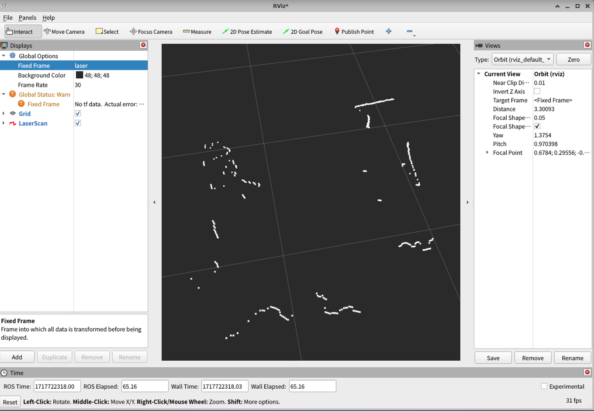

# インストール手順

URGのROS2ドライバのインストール手順は以下の通りです。
本手順は、[こちら](https://github.com/Hokuyo-aut/urg_node2)を参考にしたものです。


# ドライバソースをROS2ワークスペースにコピー

```
cd hakoniwa-digital-twin/real/sensors/drivers/Hokuyo/urg
```

```
bash install.bash
```

# ドライバをビルドする

```
cd hakoniwa-digital-twin/real/sensors/workspace
```

```
source /opt/ros/humble/setup.bash
```

```
sudo apt install python3-rosdep2
```

```
rosdep update
```

```
rosdep install -i --from-paths src/urg_node2
```


```
colcon build --symlink-install
```

```
source install/setup.bash
```

# ROS2ノードを起動する


## LiDARセンサを接続するUSBポートに権限を付与

例：
```
sudo chmod 777  /dev/ttyACM0 
```

## launchファイルをUSB接続用に編集する

src/urg_node2/launch/urg_node2.launch.pyを開いて、`params_serial.yaml` 以下のように変更します。

```
def generate_launch_description():

    # パラメータファイルのパス設定
    config_file_path = os.path.join(
        get_package_share_directory('urg_node2'),
        'config',
        'params_serial.yaml'
    )
```

## ROS2ノードを起動する

```
ros2 launch urg_node2 urg_node2.launch.py
```

## Rvizで確認する

以下のように、rviz2を起動してFixedFrameにlaserを入力し、ADDからLaserScanを選択してTopic名は /scanを選ぶと点群が表示されます。

```
rviz2
```




