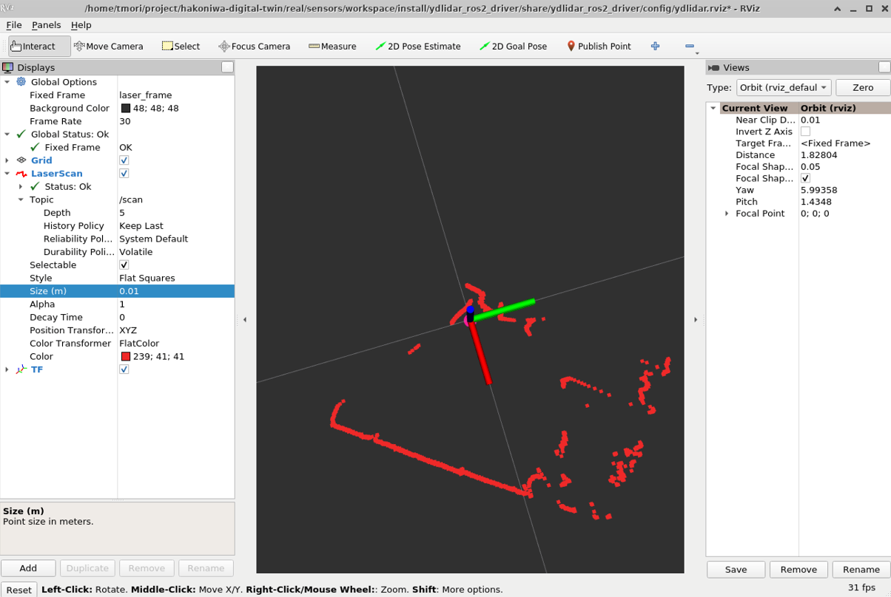

# インストール手順

TG15のROS2ドライバのインストール手順は以下の通りです。
本手順は、[こちら](https://www.switch-science.com/blogs/magazine/ydlidar-tg15-with-ros2-humble)を参考にしたものです。

- パッチを適用する
- ydlidar_ros2_driver をビルドする
- YDLidar-SDK をビルドする
- LiDARセンサのテストをする
- ydlidar の ROS2ドライバを起動する

# パッチを適用する

```
cd hakoniwa-digital-twin/real/sensors/drivers/TG15
```

```
bash install.bash
```

# ydlidar_ros2_driver をビルドする

```
cd hakoniwa-digital-twin/real/sensors/workspace
```

```
source /opt/ros/foxy/setup.bash
```

```
colcon build --packages-select ydlidar_ros2_driver
```

```
source install/setup.bash
```

# YDLidar-SDK をビルドする

事前インストール：
```
sudo apt install cmake pkg-config
sudo apt-get install swig
sudo apt-get install python3-pip
```


```
cd hakoniwa-digital-twin/third-party/YDLIDAR/YDLidar-SDK
```

```
mkdir build
cd build
```

```
cmake ..
make
sudo make install
cd YDLidar-SDK
python3 -m pip install .
```

# LiDARセンサのテストをする

1. TG15本体とUSBケーブルをUSBアダプターに接続します。
2. LiDARセンサを接続するUSBポートに権限を付与します。
3. テスト


## LiDARセンサを接続するUSBポートに権限を付与

例：
```
sudo chmod 777 /deb/tty/USB0
```

## テスト

```
cd YDLidar-SDK/build
./tri_test
```

* port番号 ： LiDARセンサのものを選択
* Baudrate： 512000 bps
* one-way scan：no
* frequency：10 Hz


成功すると、以下のログが大量に出力されます。

```
recv: BE00BD000000B000B000B000B000B000B000AF00000000000000B000B000B000B000B100B100A800A400A900A800A900A400A400AA00A500A900A900A900A400AA00AA00A400A500A900AA00AD00AE00
recv: AA550028D9314934A178
recv: AD00A700AC00AE00AF00AE00AB00A3000000000000000000A800A900AE00AE000000A100A200A200A200A300A400A400A400A500A500A400A500000000000000A400A5000000000000009C009D009E00
recv: AA55001A5F34F935364E
recv: 9B009C009D009C009D00A2009C009C009D009C009D009D009D009D009E0000009C009D009C009D009C0095009300000095009300
recv: 4EAA554F010736073671
:
```

# ydlidar の ROS2ドライバを起動する

```
cd hakoniwa-digital-twin/real/sensors/workspace
```

```
source install/setup.bash
```

```
ros2 launch ydlidar_ros2_driver ydlidar_launch_view.py
```

成功すると rvizが起動します。


